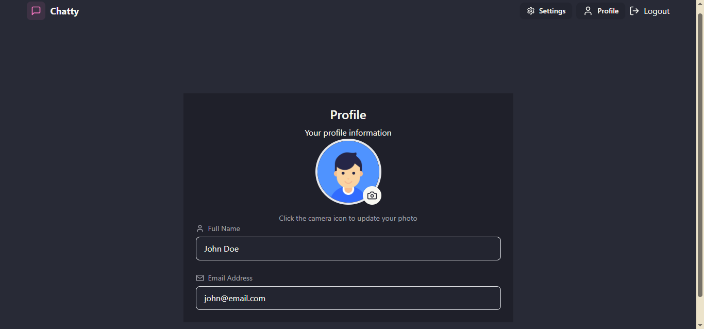

# Real-Time Chat App

A full-stack real-time chat application, built with the MERN stack and Socket.IO, facilitates real-time messaging between users. It features secure user authentication via JWTs, enabling registration, login, and profile updates with Cloudinary-stored images. The intuitive React frontend provides a dynamic chat interface with online user status, text, and image message support. The Node.js/Express backend handles API requests and real-time communication, storing data in MongoDB. Users can seamlessly connect and converse, experiencing instant message delivery and up-to-date online presence information.

## Get the Web App !

Get the deployed version of the app at https://fullstack-chat-app-r80k.onrender.com

## Screenshots




## Features

* **Instant Messaging:** Real-time chats.
* **Secure Auth:** Login/signup.
* **User Profiles:** Custom profile pictures.
* **Direct Chats:** One-on-one messaging, history saved.
* **Text & Images:** Rich messaging.
* **Online Status:** See who's online.
* **32 Themes:** Customizable look.
* **Clean UI:** Simple, responsive design.
## Tech Stack

* **Frontend:**
    * React.js
    * Tailwind CSS
    * DaisyUI
    * Axios
    * React Router
* **Backend:**
    * Node.js
    * Express.js
    * Socket.IO
* **Database:**
    * MongoDB
* **Cloud Services:**
    * Cloudinary (Image Storage)
* **Deployment:**
    * Render
## Optimizations

* **Performance Optimization:** Implemented conditional data fetching to reduce unnecessary server requests and improve application speed.
* **Deployment Efficiency:** Streamlined deployment by integrating the React frontend directly into the Node.js backend, simplifying the deployment process.

## API Reference

### Authentication Routes (/api/auth)

#### POST /signup

```http
POST /api/auth/signup
```

| Parameter | Type     | Description                |
| :-------- | :------- | :------------------------- |
| `fullName` | `string` | **Required**. User's full name |
| `email` | `string` | **Required**. User's email address |
| `password` | `string` | **Required**. User's ser's password (min 6 chars) |

#### POST /login

```http
POST /api/auth/login
```

| Parameter | Type     | Description                |
| :-------- | :------- | :------------------------- |
| `email` | `string` | **Required**. User's email address |
| `password` | `string` | **Required**. User's ser's password|

#### GET /checkauth

```http
GET /api/auth/checkauth
```

| Header | Description |
| :-------- | :------------------------- |
| `Authorization` | Bearer <JWT Token> |

#### POST /logout

```http
POST /api/auth/logout
```

#### PUT /updateProfile

```http
PUT /api/auth/updateProfile
```
| Header | Description |
| :-------- | :------------------------- |
| `Authorization` | Bearer <JWT Token> |

| Parameter | Type     | Description                |
| :-------- | :------- | :------------------------- |
| `profilePic` | `string` | **Required**. Base64 encoded image string |

### Message Routes (/api/messages)

#### GET /users

```http
GET /api/messages/users
```

| Header | Description |
| :-------- | :------------------------- |
| `Authorization` | Bearer <JWT Token> |

#### GET /:id

```http
GET /api/messages/${id}
```

| Header | Description |
| :-------- | :------------------------- |
| `Authorization` | Bearer <JWT Token> |

| Parameter | Type     | Description                |
| :-------- | :------- | :------------------------- |
| `id` | `string` | **Required**. User ID of the chat partner |

#### POST /send/:id

```http
POST /api/messages/send/${id}
```

| Header | Description |
| :-------- | :------------------------- |
| `Authorization` | Bearer <JWT Token> |

| Parameter | Type     | Description                |
| :-------- | :------- | :------------------------- |
| `text` | `string` | Optional. Message text |
| `image` | `string` | Optional. Base64 encoded image string |


### Socket.IO Events

#### connection

Establishes a socket connection.

| Query Parameter | Type     | Description                |
| :-------- | :------- | :------------------------- |
| `userId` | `string` | Optional. User ID for online status |

#### getOnlineUsers (emitted by server)
Sends an array of online user IDs to all connected clients.

#### newMessage (emitted by server)
Sends a new message object to the recipient.

#### disconnect
Socket disconnects.
## Color Reference

This application utilizes DaisyUI's extensive theme library, offering users 32 distinct visual styles. Users can select their preferred theme within the "settings" tab.

**Available Themes:**

* **Standard Themes:**
    * `light`: Classic light mode.
    * `dark`: Classic dark mode.
* **Whimsical & Playful Themes:**
    * `cupcake`: Soft, pastel tones.
    * `bumblebee`: Bright yellow and black.
    * `valentine`: Romantic pink and red.
    * `halloween`: Dark orange and purple.
    * `lemonade`: Bright yellow and white.
* **Nature-Inspired Themes:**
    * `garden`: Lush green and floral tones.
    * `forest`: Deep green and brown.
    * `aqua`: Cool blues and greens.
    * `autumn`: Warm oranges, reds, and browns.
    * `winter`: Cold blues and whites.
* **Modern & Tech Themes:**
    * `emerald`: Vibrant green and teal.
    * `corporate`: Professional and clean.
    * `synthwave`: Neon pink and blue.
    * `cyberpunk`: Futuristic and dark.
    * `wireframe`: Minimalist outline style.
    * `nord`: Icy blue and gray.
* **Retro & Artistic Themes:**
    * `retro`: Vintage, faded colors.
    * `lofi`: Muted, low-contrast tones.
    * `pastel`: Soft, light colors.
    * `fantasy`: Ethereal, colorful tones.
* **Dark & Luxury Themes:**
    * `black`: Pure black and high contrast.
    * `luxury`: Dark and gold accents.
    * `dracula`: Dark purple, green, and orange.
    * `night`: Deep dark blue.
* **Specialty Themes:**
    * `cmyk`: Cyan, magenta, yellow, and black.
    * `business`: Clean and professional.
    * `acid`: High-contrast, psychedelic colors.
    * `coffee`: Warm brown and beige tones.
    * `dim`: Darker, muted version of dark.
    * `sunset`: Orange, yellow, and red gradients.

**Note:**

* DaisyUI dynamically generates color variables for each theme, making it easy to style components consistently.
* Users can preview and select their preferred theme within the "settings" tab, providing a personalized experience.
* For specific color values for each theme, please refer to the official DaisyUI documentation, or inspect the css variables that are generated on the html elements when a theme is selected.
## Authors

- [@UmarSkh](https://github.com/UmarSkh)


## Environment Variables

To run this project, you will need to add the following environment variables to your .env file

`MONGODB_URI`

`JWT_SECRET`

`CLOUDINARY_CLOUD_NAME`

`CLOUDINARY_API_KEY`

`CLOUDINARY_API_SECRET`


## Lessons Learned

This chat app development taught key lessons in real-time communication with Socket.IO, secure JWT authentication, and efficient state management using React hooks. Integrating Cloudinary for image uploads highlighted best practices for external service interaction.

## Run Locally

Clone the project.

```bash
  git clone https://github.com/UmarSkh/fullstack-chat-app.git
```

Go to the project directory.

```bash
  cd my-project
```

Install dependencies.

```bash
  npm install
```

Start the server.

```bash
  npm run dev
```
    
## Contributing

Contributions are always welcome! Feel free to fork the repository and make a pull request.

### How to Contribute
- Fork the repository.
- Create a new branch (```git checkout -b feature-branch```).
- Make your changes.
- Commit your changes (```git commit -m 'Add new feature'```).
- Push to the branch (```git push origin feature-branch```).
- Open a pull request.

## Feedback

If you have any feedback, please let me know.
